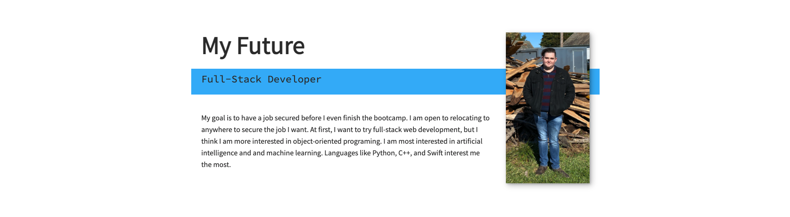
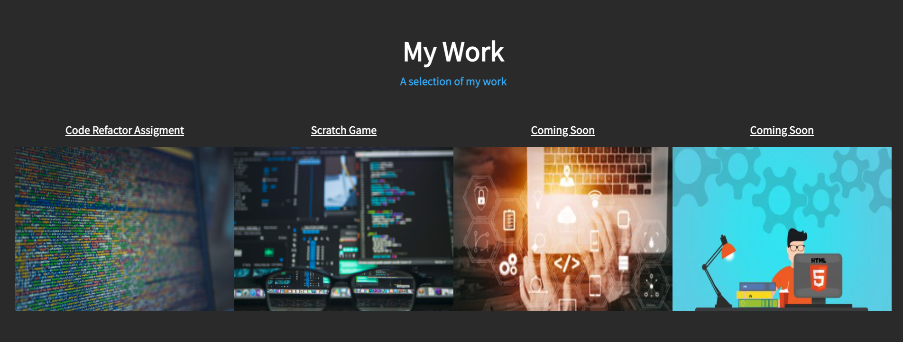

# OSU Bootcamp Homework 2

## Biggest Challanges of the Project

For this project I built my first website from scratch. The most challanging parts for me were to do the advanced CSS properties like the pseudo classed/elements and the hover properties. This let my images for my portfolio images grow when hovered. The `overflow: hidden;` property allowed the image to grow and zoom without going outside of its container. It was also very challanging for me to figure out how to make the page responsive with media queries and figuring out exactly where the break points should be. The naviagation bar and hambuger menu was also quite the challange. I also struggled with getting the blue bars to go behind the images and stick out a little on the end. 

---
## Some New Things I Learned 

I learned about some new things as well. With Font Awesome I was able to add customizable icons for github and LinkedIn. All I did was add a `` in the `<head></head>` of the html with a link provided by the website. Then you just add a unique `<i>class=""</i>` provided for each icon wherever you want it in the html. After that, you can style them with CSS. I did use some very simple JavaScript event listeners, `.addEventListener('click', () => {`, in order to make the menu appear when clicked and also to make it disappear after a link was clicked. This was not hard to figure out but was very educational, since we haven't learned this yet.

---
## Favorite Parts 

One of the coolest things for me to do was create some custom variables, like `--clr-accent: #3bb3f8;`. This made it very easy to play around with the accent color in order to get the exact shade of blue that I wanted. I also liked learning about the transitions that I used, `.nav-open .hamburger { transform: rotate(.625turn); }` to make the hamburger menu change to an "X" after clicked. Over the course of this bootcamp I will continue to add to this page to perfect it. 

---

## Link to Deployed Application

[Deployed Website](https://loganwh454.github.io/osu-bootcamp-homework-2/)

---

## Screen Shots

